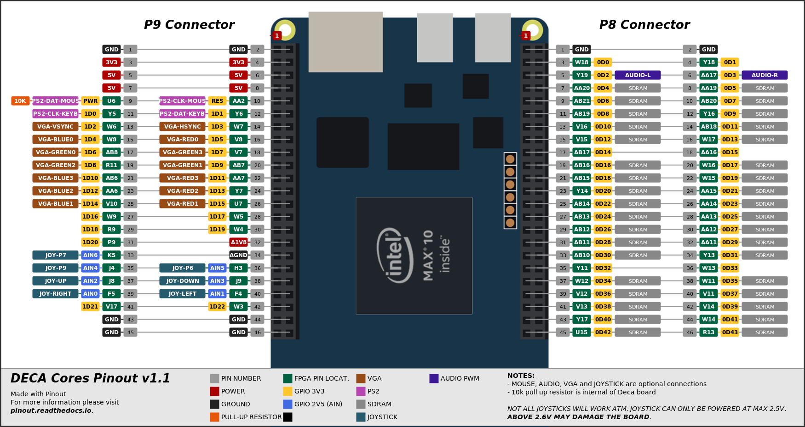

# Galaga DECA port 

DECA port for Galgaga by Somhic (07/11/21) adapted from DE10_lite port by Dar (https://sourceforge.net/projects/darfpga/files/Software%20VHDL/galaga/)

[Read history of Galaga Arcade.](https://www.arcade-museum.com/game_detail.php?game_id=7881)

[Parts and Operating Manual](Galaga_-_1981_-_Namco.pdf)

**For LCD version check deca_lcd folder.**

**Features:**

* **It does not require SDRAM.**
* HDMI video output (special resolution will not work on all LCD monitors)
* VGA 444 video output is available through GPIO (see pinout below). 
  * VGA (30 kHz) & RGB (15 kHz) modes available. Toggle VGA / RGB  with F8 key
* Line out (3.5 jack green connector) and HDMI audio output
* PWM audio is available through GPIO (see pinout below)
* Joystick available through GPIO  (see pinout below).  **Joystick power pin must be 2.5 V**
  * **DANGER: Connecting power pin above 2.6 V may damage the FPGA**
  * This core is prepared for Megadrive 6 button gamepads as it outputs a permanent high level on pin 7 of DB9

**Additional hardware required**:

- PS/2 Keyboard connected to GPIO  (see pinout below)

**Versions**:

- v5.0

**Compiling:**

* Load project from /deca/galaga_deca.qpf

* sof/svf files already included in /deca/output_files/

**Pinout connections:**

Mouse not used in this core

**Others:**

* Button KEY0 is a reset button

### STATUS

* Working fine
* HDMI video outputs special resolution so will not work on all monitors. 

Note: If keyboard is not working reset game with a press of KEY0 button

### Keyboard players inputs :

F3 : Add coins
F4 : Start 1 player
F5 : Start 2 player
SPACE       : Fire  
RIGHT arrow : right
LEFT  arrow : left

F8 : toggles VGA / RGB video mode

Sega Gamepad can be used.

Other details : see comments on top file galaga_deca.vhd

---------------------------------
Compiling for DECA
---------------------------------

 - you would need the original MAME ROM files
 - use tools included to convert ROM files to VHDL (read original README.txt)
   -   cs54xx_prog.vhd is not used in the Mist port
 - put the VHDL ROM files (.vhd) into the rtl_dar/proms directory
 - build galaga_deca
 - program galaga_deca.sof

You can build the project with ROM image embedded in the sof file.
*DO NOT REDISTRIBUTE THESE FILES*

See original [README.txt](README.txt)
------------------------

